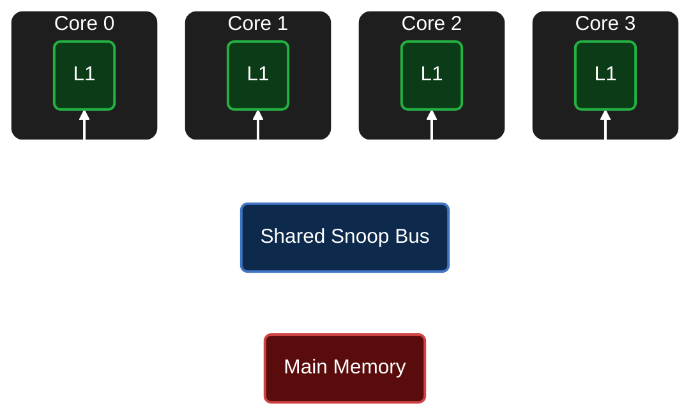

# Multi-Core MESI Cache Coherence Simulator


A cycle-accurate, Python-based multi-core SMP cache simulator modeling the **MESI (Modified, Exclusive, Shared, Invalid)** Protocol.

This project simulates a parameterized 4-core processor environment connected via a centralized snoop bus, accurately covering a wide array of realistic hardware events and complex coherence scenarios.

## System Architecture



## Key Features

* **Full MESI Protocol FSM:** Implements complete textbook state transitions (M, E, S, I) for both local processor requests (`PrRd`, `PrWr`) and remote bus snoops (`BusRd`, `BusRdX`, `BusUpgr`, `Flush`).
* **Hardware-Accurate Latencies:** Dynamically calculates cycle costs based on parallel hardware lookups (L1 Cache Hit: **1 cycle** | Silent State Upgrades: **1 cycle** | Shared Write Upgrades: **3 cycles** | Peer-to-Peer Cache Intervention: **18 cycles** | Main Memory Fetch / Dirty Eviction: **103 cycles**).
* **Tree Pseudo-LRU (PLRU) Eviction:** Implements a custom bitwise tree traversal algorithm to handle conflict misses and force dirty-line writebacks (`FLUSH`) to main memory.
* **Sequential State Modeling:** Executes instructions sequentially (one core at a time) for perfect determinism. The simulator accurately models FSM states, cycle penalties, and bus traffic without carrying the physical overhead of moving actual data payloads.

## System Configuration

The simulator is fully parameterized.
#### Example Run:
- **4-Core SMP**
- **64-Byte** cache lines
- **2-way set-associative** cache (**4 sets**)
## Scenario Coverage

* **The "4 C's" of Cache Misses:** Deterministically models Compulsory (cold), Capacity, Conflict, and Coherence misses.
* **High-Contention Handling:** Accurately simulates cache line bouncing when multiple threads fiercely compete for a single memory address.
* **Comprehensive Phase Testing:** The integration trace rigorously validates the hardware logic across 8 distinct operational phases:
  * **Phase 1:** Independent cold allocations and Exclusive (E) state assignments.
  * **Phase 2:** Local hits and silent state promotions (E -> M).
  * **Phase 3:** Multi-core shared cascades and fast cache-to-cache data supply.
  * **Phase 4:** Shared write upgrades and peer invalidations (`BusUpgr`).
  * **Phase 5:** Remote write misses and dirty data stealing (`BusRdX`).
  * **Phase 6:** Set conflicts, associativity capacity limits, and PLRU dirty evictions.
  * **Phase 7:** Rapid ping-pong contention between multiple writing cores.
  * **Phase 8:** Clean Exclusive state downgrades (bypassing unnecessary memory flushes).

## How to Run

```bash
python main.py
```

## Example Input Trace

```text
0 R 0x100
2 R 0x100
```

## Example Simulation Log

```log
Core 0 PrRd 0x100 | MISS | BusRd            | 103 cycles
Core 0 FETCH    | Main Memory fetch
STATES -> Core 0: E, Core 1: I, Core 2: I, Core 3: I
-----------------------------------------------------------------
Core 2 PrRd 0x100 | MISS | BusRd            | 18 cycles
Core 2 FETCH    | Peer cache-to-cache transfer from Core 0
STATES -> Core 0: S, Core 1: I, Core 2: S, Core 3: I
-----------------------------------------------------------------
```

## Final System Statistics

```log
=================================================================
                     SYSTEM STATISTICS                           
=================================================================
Total Accesses : 23
Total Cycles   : 1213
Global Hits    : 4 (17.39%)
Global Misses  : 19 (82.61%)
System AMAT    : 52.74 cycles
=================================================================
```

## File Structure

```text
mesi-cache-simulator/
├── src/
│   ├── bus.py        
│   ├── cache.py      
│   ├── constants.py  
│   └── core.py       
├── traces/
│   └── instructions.txt  
├── logs/
│   └── simulator.log     
└── main.py           
```