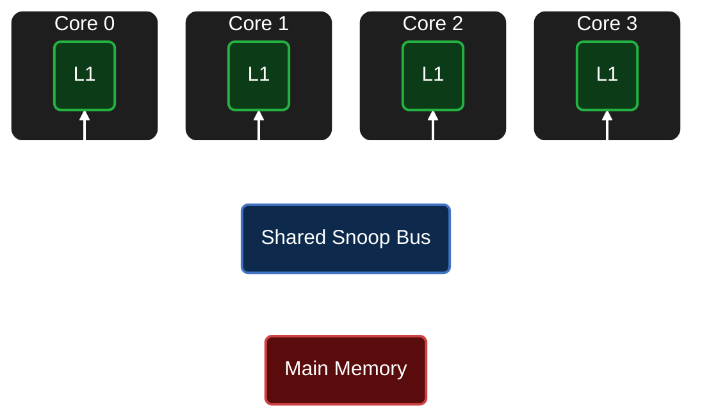

# Multi-Core MESI Cache Coherence Simulator


A cycle-accurate, Python-based multi-core SMP cache simulator modeling the **MESI (Modified, Exclusive, Shared, Invalid)** Protocol.

This project simulates a parameterized 4-core processor environment connected via a centralized snoop bus, accurately covering a wide array of realistic hardware events and complex coherence scenarios.

## System Architecture



## Key Features

* **Trace-Driven Execution Engine:** Parses per-core Read/Write instruction traces to execute instructions sequentially (strictly one core at a time), ensuring a deterministic step-by-step flow while tracking global hit/miss ratios, cycle penalties, and System AMAT.
* **Real-Hardware FSM & Bus Modeling:** Implements independent core controllers and a centralized snoop bus for complete MESI protocol state transitions (M, E, S, I) handling local requests (`PrRd`, `PrWr`) and snoop signals (`BusRd`, `BusRdX`, `BusUpgr`, `Flush`).
* **Hardware-Accurate Latencies:** Dynamically calculates cycle costs based on parallel hardware lookups (L1 Cache Hit: **1 cycle** | Silent State Upgrades: **1 cycle** | Shared Write Upgrades: **3 cycles** | Peer-to-Peer Cache Intervention: **18 cycles** | Main Memory Fetch / Dirty Eviction: **103 cycles**).
* **Tree Pseudo-LRU (PLRU) Eviction:** Implements a custom bitwise tree traversal algorithm inside set-associative cache arrays to manage capacity and conflict limits, forcing dirty-line writebacks (`FLUSH`) to main memory.
* **Control-Plane Accuracy:** Accurately models FSM states, cycle penalties, and bus traffic without carrying the physical overhead of moving actual data payloads.

## System Configuration

The simulator is fully parameterized.
#### Example Run:
- **4-Core SMP**
- **64-Byte** cache lines
- **2-way set-associative** cache (**4 sets**)

## FSM Table


## Scenario Coverage

* **The "4 C's" of Cache Misses:** Deterministically models Compulsory (cold), Capacity, Conflict, and Coherence misses.
* **High-Contention Handling:** Accurately simulates cache line bouncing when multiple threads fiercely compete for a single memory address.
* **Comprehensive Phase Testing:** The integration trace rigorously validates the hardware logic across 8 distinct operational phases:
  * **Phase 1:** Initial cold misses, reading base addresses to transition each core into the Exclusive (E) state.
  * **Phase 2:** Local write hits and silent state promotions, verifying that modifying Exclusive lines generates zero bus traffic.
  * **Phase 3:** Multi-core shared state transitions and peer-to-peer cache transfers, driving lines into the Shared (S) state across competing cores.
  * **Phase 4:** Writing to a Shared line, issuing a `BusUpgr` signal from Core 2 to invalidate remote copies.
  * **Phase 5:** Write misses on another core's Modified line, utilizing `BusRdX` to acquire the line and trigger a remote flush.
  * **Phase 6:** Associativity capacity limits and custom PLRU evictions, forcing Core 0 to evict a dirty line (`0x100`) to main memory.
  * **Phase 7:** High-contention line bouncing, testing rapid state change when multiple cores compete for the same address.
  * **Phase 8:** Reading a clean Exclusive line, validating that it transitions to Shared without triggering unnecessary memory flushes.

## How to Run

```bash
python main.py
```

## Example Input Trace

```text
0 R 0x100
2 R 0x100
```

## Example Simulation Log

```log
Core 0 PrRd 0x100 | MISS | BusRd            | 103 cycles
Core 0 FETCH    | Main Memory fetch
STATES -> Core 0: E, Core 1: I, Core 2: I, Core 3: I
-----------------------------------------------------------------
Core 2 PrRd 0x100 | MISS | BusRd            | 18 cycles
Core 2 FETCH    | Peer cache-to-cache transfer from Core 0
STATES -> Core 0: S, Core 1: I, Core 2: S, Core 3: I
-----------------------------------------------------------------
```

## Final System Statistics

```log
=================================================================
                     SYSTEM STATISTICS                           
=================================================================
Total Accesses : 23
Total Cycles   : 1213
Global Hits    : 4 (17.39%)
Global Misses  : 19 (82.61%)
System AMAT    : 52.74 cycles
=================================================================
```

## File Structure

```text
mesi-cache-simulator/
├── src/
│   ├── bus.py        
│   ├── cache.py      
│   ├── constants.py  
│   └── core.py       
├── traces/
│   └── instructions.txt  
├── logs/
│   └── simulator.log     
└── main.py           
```
